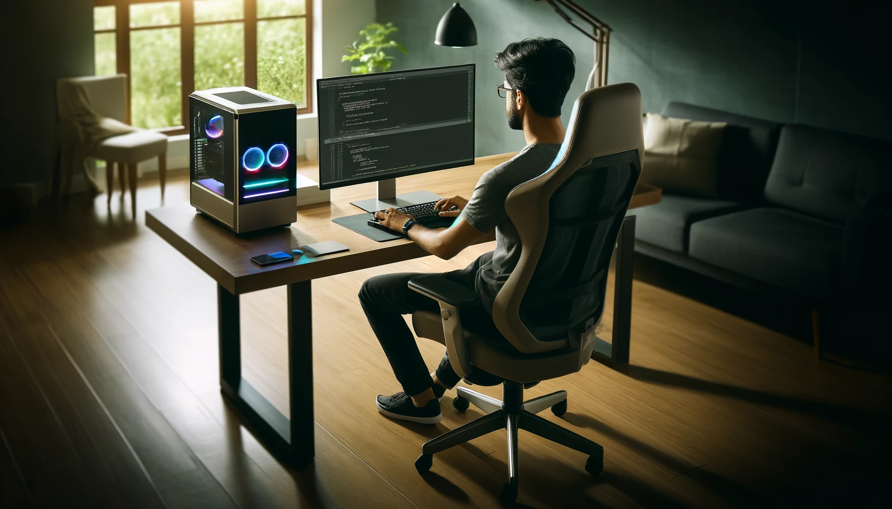

# Hello, This is Gautham 👋

I'm a Full Stack Java developer and DevOps engineer with a passion for building cloud-native, scalable web applications using Java, Spring, and modern backend technologies. I specialize in automating infrastructure with CI/CD pipelines, Docker, Kubernetes, and infrastructure-as-code tools to deliver robust and efficient solutions.

## 📫 How to reach me

- **Email:** gauthamgali14@gmail.com
- **Phone:** (540) 557-8111

<h3 align="center"><samp>🛠 Technical Skills and Interests</samp></h3>

<h4 align="center">AI / ML & Generative Technologies</h4>
<table align="center">
  <tr>
    <td align="center" width="100">
       OpenAI
    </td>
    <td align="center" width="100">
       Mistral
    </td>
    <td align="center" width="100">
       LLaMA
    </td>
    <td align="center" width="100">
       Claude
    </td>
  </tr>
  <tr>
    <td align="center" width="100">
       Vision Models
    </td>
    <td align="center" width="100">
       Gemini
    </td>
    <td align="center" width="100">
       Azure AI Studio
    </td>
    <td align="center" width="100">
       Gemini AI Studio
    </td>
  </tr>
  <tr>
    <td align="center" width="100">
       Text Tools
    </td>
    <td align="center" width="100">
       Voice Tools
    </td>
  </tr>
</table>

<!-- Languages -->
<h4 align="center">Languages</h4>
<table align="center">
  <tr>
    <td align="center" width="100">
       Java
    </td>
    <td align="center" width="100">
       C
    </td>
    <td align="center" width="100">
       C++
    </td>
    <td align="center" width="100">
       C#
    </td>
  </tr>
  <tr>
    <td align="center" width="100">
       JavaScript
    </td>
    <td align="center" width="100">
       Kotlin
    </td>
    <td align="center" width="100">
       TypeScript
    </td>
    <td align="center" width="100">
       Python
    </td>
  </tr>
  <tr>
    <td align="center" width="100">
       SQL
    </td>
    <td align="center" width="100">
       Bash
    </td>
  </tr>
</table>

<h4 align="center">Java Enterprise & Backend Tools</h4>
<table align="center">
  <tr>
    <td align="center" width="100">
       Spring
    </td>
    <td align="center" width="100">
       Spring Boot
    </td>
    <td align="center" width="100">
       J2EE
    </td>
    <td align="center" width="100">
       JSP
    </td>
  </tr>
  <tr>
    <td align="center" width="100">
       JBoss
    </td>
    <td align="center" width="100">
       JMeter
    </td>
    <td align="center" width="100">
       JPA
    </td>
  </tr>
</table>

<!-- Frameworks & Tools -->
<h4 align="center">Frameworks & Tools</h4>
<table align="center">
  <tr>
    <td align="center" width="100">
       React
    </td>
    <td align="center" width="100">
       React Native
    </td>
    <td align="center" width="100">
       Next.js
    </td>
    <td align="center" width="100">
       Node.js
    </td>
  </tr>
  <tr>
    <td align="center" width="100">
       Vue.js
    </td>
    <td align="center" width="100">
       Express.js
    </td>
    <td align="center" width="100">
       GraphQL
    </td>
    <td align="center" width="100">
       Docker
    </td>
  </tr>
  <tr>
    <td align="center" width="100">
       Kubernetes
    </td>
    <td align="center" width="100">
       TensorFlow
    </td>
    <td align="center" width="100">
       Keras
    </td>
    <td align="center" width="100">
       PyTorch
    </td>
  </tr>
  <tr>
    <td align="center" width="100">
       Scikit-learn
    </td>
  </tr>
</table>

<!-- Databases -->
<h4 align="center">Databases</h4>
<table align="center">
  <tr>
    <td align="center" width="100">
       MongoDB
    </td>
    <td align="center" width="100">
       PostgreSQL
    </td>
    <td align="center" width="100">
       MySQL
    </td>
    <td align="center" width="100">
       Firebase
    </td>
  </tr>
  <tr>
    <td align="center" width="100">
       Redis
    </td>
    <td align="center" width="100">
       Kafka
    </td>
    <td align="center" width="100">
       Memcached
    </td>
  </tr>
</table>

<!-- Platforms -->
<h4 align="center">Platforms</h4>
<table align="center">
  <tr>
    <td align="center" width="100">
      
        
       Linux
    </td>
    <td align="center" width="100">
      
        
       Windows
    </td>
    <td align="center" width="100">
      
        
       Android Studio
    </td>
    <td align="center" width="100">
      
        
       Apple
    </td>
    <td align="center" width="100">
      
        
       VS Code
    </td>
  </tr>
  <tr>
    <td align="center" width="100">
      
        
       AWS
    </td>
    <td align="center" width="100">
      
        
       GCP
    </td>
    <td align="center" width="100">
      
        
       Azure
    </td>
    <td align="center" width="100">
      
        
       Informatica
    </td>
  </tr>
</table>

<!-- Others -->
<h4 align="center">Other Tools</h4>
<table align="center">
  <tr>
    <td align="center" width="100"> Git</td>
    <td align="center" width="100"> GitHub</td>
    <td align="center" width="100"> Postman</td>
    <td align="center" width="100"> Figma</td>
    <td align="center" width="100"> Jira</td>
  </tr>
</table>

## 🏫 Education

- **M.S. in Computer Science, Virginia Tech**  
  August 2023 - December 2024

## 💼 Professional Experience

### Research Intern, George Mason University 
**March 2025 – Present**  
- Built an MLOps framework using GCP Vertex AI, Kubernetes, and Cloud Composer to automate LLM workflows.  
- Implemented AI compliance processes and monitored data lakes for SLA adherence and billing insights.  
- Automated model deployment and scaling using GKE and Terraform.

### Graduate Student, Virginia Tech
**August 2023 – December 2024**
- Mastering data structures, algorithms, and software engineering.
- Hands-on experience in LLM fine-tuning and image processing.
- Completed 10+ advanced projects, improving AI model accuracy by 70%.

### Software Engineer 2, Informatica
**March 2021 – July 2023**
- Developed Terraform scripts for Jenkins pipeline, enhancing cloud capabilities.
- Automated zero-downtime deployments, improving efficiency by 60%.
- Led Scrum meetings, facilitating agile workflows.
- Automated webhook data migration with Kubernetes.
- Developed automation scripts, improving deployment efficiency by 70%.
- Designed efficient REST APIs with Swagger.

### Associate Software Engineer, Nokia Networks
**February 2020 - February 2021**
- Orchestrated Kubernetes clusters for fault tolerance.
- Enhanced server connections using Python.

### Junior Software Engineer, Orbysol Systems  
**April 2018 – February 2020**  
- Developed cloud-native backend systems on AWS using ECS, ALB, and Terraform.  
- Integrated Fluentd and ELK Stack for observability across data pipelines.  
- Provisioned auto-scaling infrastructure and collaborated with cross-functional teams on SLA-driven solutions.

## 🔧 Projects
### Brain Tumor Detection using Deep Learning and Explainable AI with LLaMA 3B Instruct   
**Dec 2024 – Present**  
- Developed a CNN-based classification model to detect brain tumors from MRI images with high accuracy.  
- Integrated the model into a user-friendly web interface for real-time diagnosis assistance.  
- Fine-tuned LLaMA 3B Instruct for explainable question-answering on medical datasets.  

### Algosphere - Interactive Algorithm Visualizer  
**July 2024 – October 2024**  
- Built an interactive visualization tool for teaching data structures and algorithms.  
- Enabled step-by-step execution and graphical video output for algorithms like Dijkstra, Merge Sort, and DFS/BFS.

### Political Bias Detection App using LLM
**January 2024 – May 2024**
- Crafted a political bias detection tool using Python and Gemma 7B.

### Web Application
**August 2023 – December 2023**
- Utilized AWS services to construct and launch a platform with features like load balancing and fault tolerance.

## 🏅 Leadership Experience

### Mentor, Informatica LLC
**February 2021 – July 2023**
- Assisted in onboarding new interns and engineers.

### Core Team Member of Atmatrisha, PES University
**August 2016 - August 2020**
- Coordinated a college festival with over 5,000 participants.

## 🌐 Connect with Me

